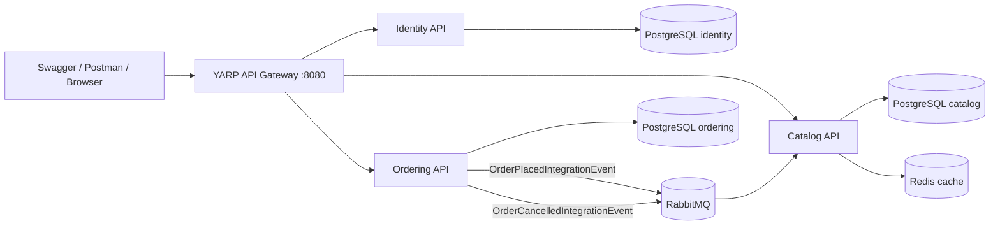

# LibraryHub: Scalable Resource Management Engine

LibraryHub is a production-ready prototype of an event-driven microservice system for an online library. It implements Catalog, Ordering, Identity, and API Gateway services with PostgreSQL, Redis, RabbitMQ/MassTransit, JWT authorization, Swagger documentation, Docker Compose, and xUnit/Moq tests.

## Architecture



## Services

- `Identity.API` - registration, login, JWT token generation, Admin/User roles.
- `Catalog.API` - book CRUD, advanced LINQ filtering, sorting, paging, Redis caching.
- `Ordering.API` - rental order placement/cancellation, business rules, event publishing.
- `ApiGateway` - single entry point using YARP.
- `EventBus` - shared integration event contracts.

Each microservice follows layered separation:

- `Domain` - entities and invariants.
- `Application` - business use cases, DTOs, validators, repository abstractions.
- `Infrastructure` - EF Core, PostgreSQL, Redis, RabbitMQ/MassTransit.
- `API` - controllers, Swagger, authentication, middleware.

## Run

Prerequisites:

- Docker Desktop
- .NET SDK 10 for local build/tests

Start the whole stack:

```powershell
cd "C:\Users\Akbota\OneDrive\Документы\New project\LibraryHub"
docker-compose up --build
```

Open:

- Gateway: `http://localhost:8080`
- Identity Swagger: `http://localhost:8080/identity/swagger`
- Catalog Swagger: `http://localhost:8080/catalog/swagger`
- Ordering Swagger: `http://localhost:8080/ordering/swagger`
- RabbitMQ UI: `http://localhost:15672` (`guest` / `guest`)

## Demo Scenario

1. Register admin:

```http
POST /identity/api/auth/register
{
  "email": "admin@libraryhub.kz",
  "fullName": "Admin User",
  "password": "Password1",
  "role": "Admin"
}
```

2. Copy the returned JWT token and authorize Swagger with `Bearer {token}`.

3. Create a book:

```http
POST /catalog/api/books
{
  "isbn": "978-0134494166",
  "title": "Clean Architecture",
  "author": "Robert C. Martin",
  "genre": "Software",
  "publicationYear": 2017,
  "price": 12.50,
  "totalCopies": 5
}
```

4. Register or login as a normal user.

5. Place an order through Ordering API. Ordering publishes `OrderPlacedIntegrationEvent`; Catalog consumes it and decreases `AvailableCopies`.

6. Cancel the order. Ordering publishes `OrderCancelledIntegrationEvent`; Catalog returns the copies.

## Advanced Catalog Filtering

`GET /catalog/api/books` supports:

- `search`
- `author`
- `genre`
- `minYear`, `maxYear`
- `minPrice`, `maxPrice`
- `availableOnly`
- `sortBy=title|author|year|price|available`
- `desc=true|false`
- `page`, `pageSize`

## Tests

Run:

```powershell
dotnet test
```

Current result in this workspace:

- Identity tests: 3 passed
- Catalog tests: 4 passed
- Ordering tests: 4 passed
- Total: 11 passed

The tests cover domain invariants and Application-layer behavior: authentication, duplicate users, invalid login, inventory reserve rules, filtering, cache invalidation, order total calculation, event publishing, and authorization checks.

## Why These Technologies

- PostgreSQL: reliable relational persistence per service and strong consistency inside each bounded context.
- Redis: fast catalog query cache for frequently searched book lists.
- RabbitMQ + MassTransit: durable asynchronous messaging with typed consumers and publisher abstractions.
- YARP: lightweight ASP.NET-native reverse proxy for a single API entry point.
- JWT: stateless authentication suitable for distributed APIs.
- xUnit + Moq: simple unit testing of core business logic without infrastructure dependencies.

## Notes for Defense

- Catalog never calls Ordering directly. It reacts to events, which keeps services loosely coupled.
- `IBookRepository.Query()` returns `IQueryable<Book>` so LINQ filters can be translated to SQL by EF Core.
- Domain entities protect invariants: stock cannot go below zero, rental period cannot exceed 30 days, cancelled orders cannot be cancelled twice.
- API controllers are thin; use cases live in Application services.
- Environment variables in `docker-compose.yml` override local `appsettings.json`.
